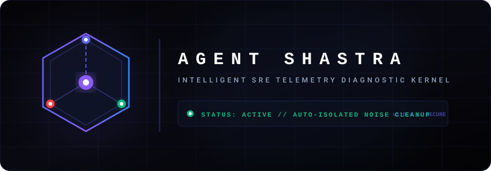

<p align="center">
  
</p>

<p align="center">
  
  
  
</p>

<p align="center">
  <b>API Anomaly Detection & Root-Cause Resolution Engine</b> — Created by <b>Kishan Kumar</b>
</p>

---

Microservice incidents generate hundreds of alerts simultaneously. On-call engineers waste time triaging noise instead of fixing root causes.

Agent Shastra ingests structured JSON API telemetry, detects latency spikes and error rate anomalies, groups concurrent multi-service failures chronologically, and produces a ranked incident report with step-by-step debugging playbooks.

Output: a machine-readable `alert.json` and an interactive SRE dashboard — ready in seconds.

---

## ⭐ Core Capabilities

1. **🧠 Dual-Engine Diagnostics (Gemini AI + Local Fallback)**
   * Connects to Google Gemini (`gemini-2.0-flash`) for AI-powered root-cause analysis when online.
   * Automatically activates a local heuristics engine if no API key is present, the network is unreachable, or rate limits are hit. Sensitive logs never leave the local environment.

2. **🛡️ Zero-Leakage Baseline Isolation**
   * Traditional monitors suffer from "baseline dilution" — spikes bleed back into rolling averages and desensitize detection thresholds.
   * Agent Shastra segments anomalies immediately upon detection and excludes them from all subsequent baseline calculations.

3. **🗺️ Interactive Dependency Topology Map**
   * A dynamic SVG node map (`VPC-Gateway` → `auth-service`, `payment-api`, `order-api`).
   * Degraded nodes transition into a pulsing alert state and surface live diagnostic context directly in the UI.

4. **📋 Actionable SRE Playbooks**
   * Each incident produces a checkable task list for on-call engineers.
   * Terminal commands (Docker inspect, slow query logs, database diagnostics) are copyable with a single click.

5. **📋 Debounced JSON Paste Validator**
   * Supports direct raw clipboard paste of log data.
   * A 300ms debounced parser validates format and outputs instant state badges: `Awaiting Input` → `Valid Format` → `Partial Warning` → `Invalid Format`.

---

## 📥 Example Input

Upload or paste structured JSON API telemetry logs. Each entry must include:

```json
[
  {
    "timestamp": "2024-06-15T10:00:00Z",
    "endpoint": "/payment/process",
    "status": 200,
    "latency_ms": 102.3,
    "service": "payment-api"
  }
]
```

**Required fields:** `timestamp` · `endpoint` · `status` · `latency_ms`  
**Optional field:** `service`  
**Format:** JSON array. Malformed rows are skipped with warnings; valid rows are processed.

---

## 📋 Example Output (`alert.json`)

When anomalies are detected and grouped, the pipeline generates a structured, machine-readable `alert.json` report in the root directory:

```json
{
  "alert_id": "2026-05-25-001",
  "generated_at": "2026-05-25T06:30:15Z",
  "total_incidents": 1,
  "severity": "CRITICAL",
  "incidents": [
    {
      "group_id": "8f9b2d3c4e",
      "endpoint": "/payment/process",
      "failure_type": "latency_spike",
      "severity": "CRITICAL",
      "occurrences": 3,
      "first_seen": "2024-06-15T10:00:00Z",
      "last_seen": "2024-06-15T10:02:00Z",
      "baseline_ms": 100.5,
      "peak_ms": 2500.0,
      "likely_causes": [
        "Likely: database connection pool exhaustion — check active connections",
        "Likely: slow query or lock contention — review recent slow query logs"
      ],
      "recommended_actions": [
        "Scale database connection pool limits or kill long-running transactions",
        "Verify Slow Query Logs in PostgreSQL/MySQL and check database CPU usage"
      ]
    }
  ]
}
```

---

## 🛠️ Tech Stack

### 🐍 Backend (Python 3.10+)
| Component | Technology |
|---|---|
| API Framework | **FastAPI** |
| ASGI Server | **Uvicorn** (port 8000) |
| Data Validation | **Pydantic v2** |
| AI Engine | **Google Gemini (`gemini-2.0-flash`)** |
| Secondary LLM | **Anthropic Claude** (optional) |
| Secret Management | **python-dotenv** |

### ⚛️ Frontend (Next.js 15+)
| Component | Technology |
|---|---|
| Framework | **Next.js 15 / React 19** (TypeScript) |
| Styling | **Tailwind CSS** |
| Animations | **Framer Motion** |
| Icons | **Lucide React** |

---

## 🚀 Architectural Blueprint (The 5-Stage SRE Pipeline)

```
  Structured API Telemetry Logs
             │
             ▼
  ┌──────────────────────────────────┐
  │  Stage 1: Resilient Log Parser   │ ──► Drops malformed rows, enforces strict ISO-8601
  └──────────────────────────────────┘
             │
             ▼
  ┌──────────────────────────────────┐
  │  Stage 2: Anomaly Detector       │ ──► Isolated rolling baselines (mean & std dev)
  └──────────────────────────────────┘
             │
             ▼
  ┌──────────────────────────────────┐
  │  Stage 3: Chronological Grouper  │ ──► Clusters concurrent anomalies in O(N log N)
  └──────────────────────────────────┘
             │
             ▼
  ┌──────────────────────────────────┐
  │  Stage 4: Diagnostics Analyzer   │ ──► Gemini 2.0 Flash / Local Offline Fallback
  └──────────────────────────────────┘
             │
             ▼
  ┌──────────────────────────────────┐
  │  Stage 5: Incident Reporter      │ ──► Generates alert.json & CLI summaries
  └──────────────────────────────────┘
```

### 🔍 Stage 1: Resilient Log Parser (`parser.py`)
A non-crashing parser that audits raw JSON inputs row-by-row:
* Filters out malformed entries, missing fields, or invalid types without halting the pipeline.
* Enforces strict ISO-8601 timestamp conformance and ignores status codes outside SRE ranges `[100-599]`.
* Generates granular warning feeds, logging exact reasons for each skipped row.

### 📈 Stage 2: Anomaly Detector (`detector.py`)
Protects baselines from leakage, ensuring historical spikes never dilute rolling thresholds:
* **Latency Engine**: Computes isolated baselines by splitting logs per endpoint into two disjoint segments:
  * **Historical Baseline Window**: `older_half` (first 50% of chronological logs) where rolling mean ($\mu$) and sample standard deviation ($\sigma$) are calculated.
  * **Recent Evaluation Window**: `newer_half` (last 50% of chronological logs) where peak latency is evaluated.
  * **Thresholds**: Triggered when the peak latency in the `newer_half` exceeds $\mu + 2\sigma$ (or $5 \times \mu$ under zero-variance baselines).
  * **SRE Ratio Filter Guard**: Bypasses low-variance, minor latency increases by strictly requiring a relative increase ratio $\ge 2.0$ (WARNING floor) before flagging.
* **Error Rate Engine**: Evaluates trailing 50-request windows split into two **disjoint** (non-overlapping) segments:
  * **Historical Baseline Window**: `window[:-10]` — 40 logs preceding the current state.
  * **Recent State Window**: `window[-10:]` — the last 10 logs.
  * An error rate anomaly triggers only if `current_rate` exceeds `5%` (`ERROR_RATE_THRESHOLD`) **OR** `current_rate > baseline_rate + 10pp` (`ERROR_RATE_DELTA`).
* **Deterministic Severity Scoring**:
  * **Latency**: Ratio $\ge 10 \rightarrow$ `CRITICAL`, $\ge 5 \rightarrow$ `HIGH`, $\ge 2 \rightarrow$ `WARNING`.
  * **Error Rate**: Rate $\ge 20\% \rightarrow$ `CRITICAL`, $\ge 10\% \rightarrow$ `HIGH`, $\ge 5\% \rightarrow$ `WARNING`.

### 🔗 Stage 3: Chronological Grouper (`grouper.py`)
Clusters multi-service anomalies using $O(N \log N)$ sorting and a linear sliding window:
* Groups failures occurring within a 120-second delta window — no nested loops.
* Generates deterministic, unique `group_id` signatures using SHA-1 hashing.

### 🧠 Stage 4: Diagnostics Analyzer (`analyzer.py`)
Enriches grouped alerts with root causes and recommended actions:
* **Active LLM**: Connects to **Google Gemini (`gemini-2.0-flash`)** to evaluate telemetry signals and generate contextual root causes.
* **Local Fallback**: If credentials are absent or the network is unavailable, activates localized diagnostic templates — including shared dependency degradation warnings for co-occurring failures.

### 📊 Stage 5: Incident Reporter (`reporter.py`)
Writes machine-readable `alert.json` and prints a structured CLI summary.

---

## 🖥️ Frontend Experience

The Next.js client acts as an interactive SRE workspace:

* **Dependency Topology Map**: Dynamic SVG node map. Degraded nodes glow, pulse, and display live diagnostic context.
* **JSON Log Paste Board**: Monospace paste area with debounced validation and instant state badges.
* **Playbook Action Checklist**: Checkable investigation steps with one-click terminal command copying.
* **Dual-Source Engine Badges**: Status badges dynamically reflect the active engine: `Gemini Engine` → `Claude Engine` → `Offline Engine`.
* **Raw Output Modal**: Displays the full `alert.json` payload in high-contrast white text on a dark background.
* **Dark / Light Mode**: Full theme toggle across all UI components.

---

## 🚀 Installation & Developer Setup

### ⚡ 2-Minute Quickstart (Unified Host)
Agent Shastra comes pre-packaged with pre-built production static web assets in the backend repository. **A stranger can get the entire interactive SRE dashboard live in under 2 minutes without installing Node.js or running npm builds!**

Ensure **Python 3.10+** is installed, then run:

```bash
# 1. Clone the repository
git clone https://github.com/techwithkishan/Agent-Shastra.git
cd Agent-Shastra

# 2. Install Python backend requirements
pip install -r requirements.txt

# 3. Spin up the unified FastAPI server
python main.py
```
*Open your web browser and navigate directly to **`http://localhost:8000`** to access the entire SRE dashboard!*

---

### 🛠️ Developer Mode (Independent Frontend Dev)
If you want to modify or edit the React/TypeScript App Router frontend components:

1. Ensure **Node.js 18+** is installed.
2. From the project root, navigate to the frontend directory:
   ```bash
   cd frontend
   npm install
   npm run dev
   ```
3. The hot-reloading development dashboard will be live at **`http://localhost:3000`**, automatically communicating with your backend API on port `8000`.

---

## 🔑 Configuring Your Gemini API Key

```bash
cp .env.example .env
```

Open `.env` and add your key from [Google AI Studio](https://aistudio.google.com):
```env
GEMINI_API_KEY=your_key_here
```

> If no key is provided, the agent automatically activates the offline fallback engine with no performance penalty.

---

## 🧪 Test Harness

Agent Shastra includes a test runner (`test_detector.py`) verifying 13 distinct edge cases.

```bash
python test_detector.py
```

| Test | Description | Expected |
|---|---|---|
| Test 1 | Normal healthy logs | 0 anomalies |
| Test 2 | Latency spike | 1 CRITICAL spike detected |
| Test 3 | Error rate spike | Disjoint window, 50% failure rate |
| Test 4 | Multi-endpoint logs | Isolates degraded auth endpoint |
| Test 5 | Under-sampled logs | Gracefully skips small windows |
| Test 6 | Baseline isolation | Zero spike leakage into baseline mean |
| Test 7 | Single outlier (3×) | Maps to WARNING severity |
| Test 8 | 50% malformed entries | Skips corrupt, audits valid rows |
| Test 9 | Noisy baseline variance | No false positives on oscillating network |
| Scenario A | 40 healthy + 10 failures | Baseline ≈ 0%, Current ≈ 100% → CRITICAL |
| Scenario B | Old failures, recent healthy | No alert — recovered baseline |
| Scenario C | 200ms/500ms base + 1000ms spike | Realistic WARNING severity |
| Scenario D | Stable latencies only | No false alarms triggered |

---

## Known Limitations

- **Log Stream Truncation (Odd Counts < 20)**: When an endpoint's total telemetry log count is odd and below 20 requests, the clean 50/50 window split uses integer division (e.g., $19 // 2 = 9$ requests). This inherently drops the very first (oldest) log entry from both baseline and evaluation windows.
- **Historically Recovered Incidents**: Anomaly spikes that occurred historically at the very beginning of the log stream and fully recovered prior to the recent evaluation window will not be flagged. This is a fundamental limitation of localized sliding-window systems, as the agent is designed to prioritize active or recently ongoing failures over historical ones.
- **Observability Scope**: The system provides advisory root-cause diagnostics and checklists; it does not replace comprehensive time-series APM platforms or modify production infrastructure automatically.
- **Input Constrains**: Optimized specifically for structured JSON telemetry arrays. Highly malformed rows are audited and skipped gracefully.


---

## 📄 License & Ownership
Copyright © 2026 Agent Shastra. All rights reserved.

Created, developed, and owned by **Kishan Kumar** ([GitHub Profile](https://www.github.com/techwithkishan)).
